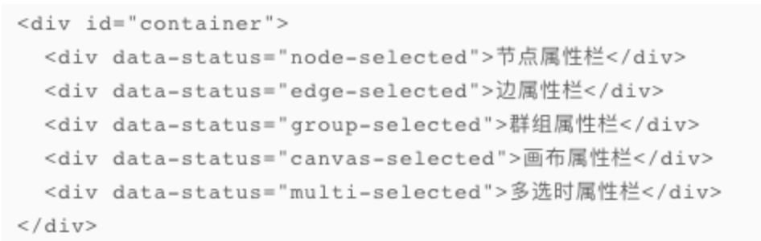
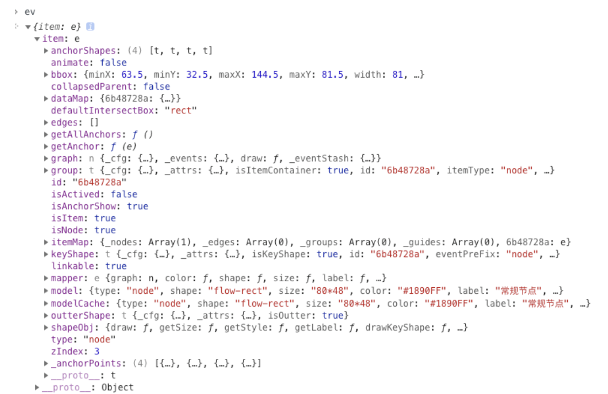
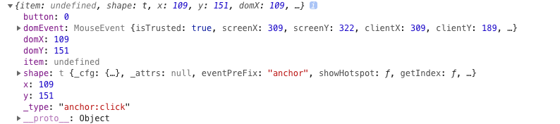
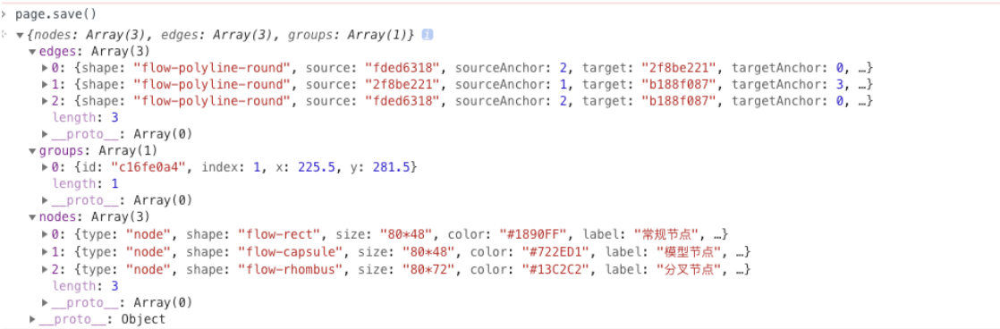

## G6-Editor问题点研究（云方,付裕）
> 主要解决问题点
* 1.node自定义绘制节点（节点的注册）
* 2.edge（边的注册）
* 3.detailpannel属性显示，属性的修改（text，color，size）
* 4.page
* 5.锚点的位置,连接事件，点击事件，可控制是否显示，是否可作为源锚点添加边等
* 6.数据的保存和读取

> 待解决问题
* 1.G6Editor与Extjs的结合
* 2.node节点中自定义属性的动态修改
* 3.node图形的修改（如图形右半部分的icon动态修改成我们需要的图片）
* 4.edge控制节点连接线个数
* 5.page中canvas的属性研究
* 6.自动布局

## 以下为已研究问题点详情
### node（付裕）
##### 1.自定义绘制节点
左边可以放置svg或者缩略图在itempannel中
```<div id="itempannel"></div>```

###### 1）注册节点 先注册一个基础节点
```const Flow = G6Editor.Flow;
// 注册模型卡片基类
Flow.registerNode('model-card', {
  draw(item) {
    const group = item.getGraphicGroup();
    const model = item.getModel();
    const width = 184;
    const height = 40;
    const x = -width / 2;
    const y = -height / 2;
    const borderRadius = 4;
//addshape给图形组添加基础图形
    const keyShape = group.addShape('rect', {
      attrs: { //基础图形属性
        x,
        y,
        width,
        height,
        radius: borderRadius,
        fill: 'white',
        stroke: '#CED4D9'
      }
    });
    // 左侧色条
    group.addShape('path', {
      attrs: {
        path: [
          [ 'M', x, y + borderRadius ],
          [ 'L', x, y + height - borderRadius ],
          [ 'A', borderRadius, borderRadius, 0, 0, 0, x + borderRadius, y + height ],
          [ 'L', x + borderRadius, y ],
          [ 'A', borderRadius, borderRadius, 0, 0, 0, x, y + borderRadius ]
        ],
        fill: this.color_type
      }
    });
    // 类型 logo
    group.addShape('image', {
      attrs: {
        img: this.type_icon_url,
        x: x + 16,
        y: y + 12,
        width: 20,
        height: 16
      }
    });
    // 名称文本
    const label = model.label ? model.label : this.label;
    group.addShape('text', {
      attrs: {
        text: label,
        x: x + 52,
        y: y + 13,
        textAlign: 'start',
        textBaseline: 'top',
        fill: 'rgba(0,0,0,0.65)'
      }
    });
    // 状态 logo
    group.addShape('image', {
      attrs: {
        img: this.state_icon_url,
        x: x + 158,
        y: y + 12,
        width: 16,
        height: 16
      }
    });
    return keyShape;
  },
  // 设置锚点
  anchor: [
    [ 0.5, 0 ], // 上面边的中点
    [ 0.5, 1 ] // 下边边的中点
  ]
});
```
###### 2）在注册一个单独节点继承基础节点
```
Flow.registerNode('PS-SMART', {
  label: 'PS-SMART 分类',
  color_type: '#1890FF',
  type_icon_url: 'https://gw.alipayobjects.com/zos/rmsportal/czNEJAmyDpclFaSucYWB.svg', //左边icon的url
  state_icon_url: 'https://gw.alipayobjects.com/zos/rmsportal/MXXetJAxlqrbisIuZxDO.svg', //右边的icon的url
  // 设置锚点
  anchor: [
    [ 0.5, 0, {
      type: 'input'
    }],
    [ 0.33, 1, {
      type: 'output'
    }],
    [ 0.66, 1, {
      type: 'output'
    }]
  ]
}, 'model-card');
```

#### 2.detailpannel属性显示（云方）
属性的修改与图形的改变（颜色，大小，text文本等）
容器标识约定data-status


`选中对象时动态获取该对象的属性值`

```
page.on('afteritemselected', ev => {
	
}
```

##### input的onchange事件
`修改节点,边,组名称`

```
        function changeInput(name,value){
            const selectedItems = page.getSelected();
            selectedItems.forEach(item => {
                const updateModel = {};
                updateModel['label'] = value;
                page.update(item, updateModel);
            });
        };
 ```
 `修改节点大小`
       
```

function changeInputSize(name,value){
            const selectedItems = page.getSelected();
            if(name == "gant-width"){
                var newSize = value + '*' + selectedItems[0].model.size.split("*")[1];
            }else if(name == "gant-height"){
                var newSize = selectedItems[0].model.size.split("*")[0] + '*' + value;
            }
            selectedItems.forEach(item => {
                const updateModel = {};
                updateModel['size'] = newSize;
                page.update(item, updateModel);
            });
        };
```
### edge

`注册边`（付裕）
```
G6.registerEdge(name, {
  // 绘制
  draw(item) {
	const group = item.getGraphicGroup();
	const path = this.getPath(item);

	const keyShape = group.addShape('path', {
      	attrs: {
        path,//默认路径
        stroke: 'red',
        lineDash: [2, 2], //canvas中的属性，虚线
        endArrow: true  //是否有结束箭头
      }

    return keyShape
  },
  // 获取路径
  getPath(item) {
    return path; // svg 规范 path 路径 
  },
  // 起始箭头
  startArrow: {
    // 路径
    path(item) {},
    // 线缩短偏移
    shorten(item) {},
    // 样式
    style(item) {}
  },
  // 结束箭头
  endArrow: {
    // 路径
    path(item) {},
    // 线缩短偏移
    shorten(item) {},
    // 样式
    style(item) {}
  }
}, extendShape);
```

`线的形状三种`（云方）
```
//flow-polyline折线
//flow-smooth曲线
page.changeAddEdgeModel({
    shape: 'flow-polyline-round'//圆角折线
});
```
### page（付裕）
```
const page = new G6Editor.Flow({
  graph: {
    container: 'page',
    height
  },
  align: {
    grid: true
  },
  noEndEdge: false, //连接线true时可不连接锚点，终端可以悬空，默认是true
  edgeResizeable: true，//为true时选中线段可拖动整个graph，默认true
});
```
`网格（云方）`
```
page.showGrid();
page.hideGrid();
```
### 锚点（云方）
`锚点相对于node的位置，多个的话可用数组形式呈现`
```
anchor: [
  [1, 0.5],
  [0.5,1],
  [0,0.5],
  [0.5,0]
],
```
`type可控制锚点的输入输出`
```
anchor: [
    [ 0.5, 0, {
        type: 'input'
    }],
    [ 0.5, 1, {
        type: 'output'
    }]
]
```
`锚点的连接事件`

>给节点设置name属性，通过判断链接目标的name属性控制是否可以链接（name可以换成其他属性），该情况下可用作源节点
```
page.on('dragedge:beforeshowanchor', ev=>{
            console.log(ev) //每个节点都会触发这个事件
            if(ev.target.model.name=="yesnode"){
                ev.cancel = true;
            }
            // ev.sourceAnchor  源锚点
            // ev.source        源子项
            // ev.targetAnchor  目标锚点
            // ev.target        目标子项

            // ev.cancel = true; // 若设置为 true 则取消显示要去连接的锚点
        });
```
`鼠标悬浮节点后显示锚点前，可用作控制，锚点是否显示`
```
flow.on('hovernode:beforeshowanchor', ev=>{
  // ev.item    子项
  ev.cancel = true; // 若设置为 true 则取消显示锚点
});  
```
`鼠标悬浮锚点后，开启添加边模式前，可用作控制，哪些锚点可添加边`
```
flow.on('hoveranchor:beforeaddedge', ev=>{
  // ev.anchor  锚点
  // ev.item    子项
  ev.cancel = true; // 若设置该锚点不会触发连接模式
});
```
`锚点点击事件`
```
graph.on('anchor:click', ev=>{});
```

 
### 数据的储存和读取(付裕)
```
const data = flow.save();
```

```
const data = flow.read(data);
```
### 修改节点背景色颜色选择器colpick插件（云方）
```
$('.color-box').colpick({
    colorScheme:'dark',
    layout:'rgbhex',
    color:color,
    onSubmit:function(hsb,hex,rgb,el) {
        const selectedItems = page.getSelected();
        selectedItems.forEach(item => {
            const updateModel = {};
            updateModel['color'] = '#'+hex;
            page.update(item, updateModel);
        });
        $(el).css('background-color', '#'+hex);
        $(el).colpickHide();
    }
})
```


